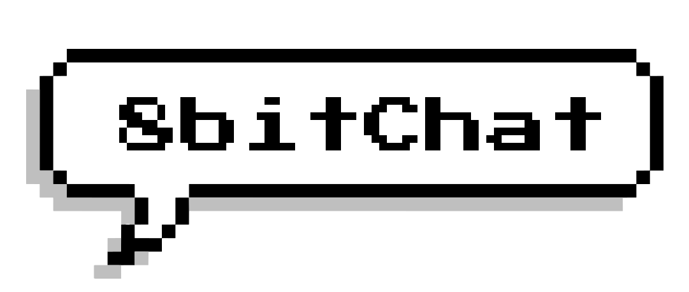
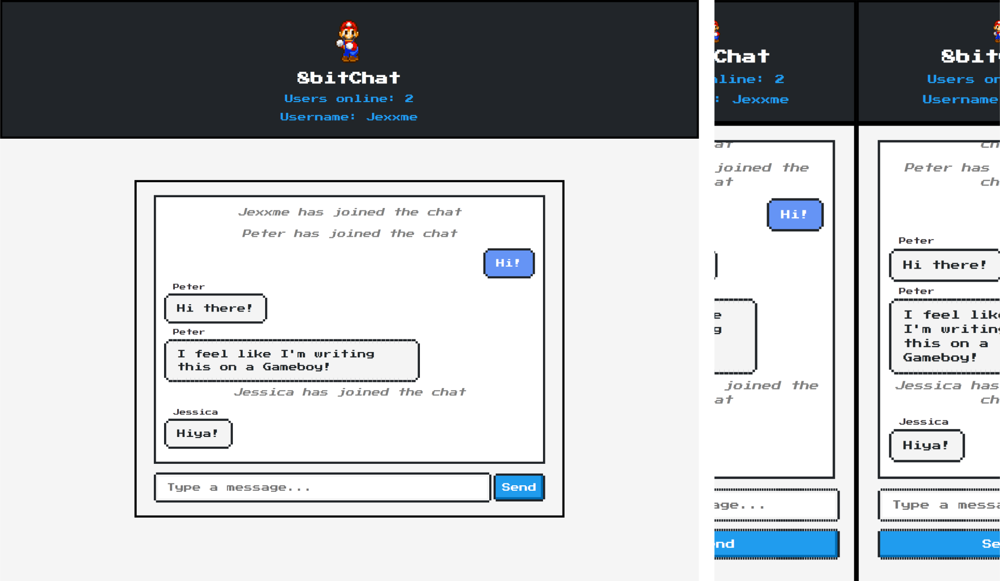

<p align="center">
  
</p>

# 8bitChat - Real-Time Chat Application
A real-time, retro-style chat application built with Flask and NES.CSS.
## Table of Contents

- [Introduction](#introduction)
- [Features](#features)
- [Technologies Used](#technologies-used)
- [Privacy and Security](#privacy-and-security)
- [Access 8bitChat](#access-8bitchat)
- [Getting Started](#getting-started)
  - [Prerequisites](#prerequisites)
  - [Installation](#installation)
- [Usage](#usage)
- [Project Structure](#project-structure)
- [Contributing](#contributing)
- [License](#license)

---

## Introduction

8bitChat is a real-time chat application that allows users to communicate with each other in a retro, 8-bit style interface. It provides a simple and fun way for users to chat and interact online. The application is built using Flask for the backend, and it utilizes Flask-SocketIO to enable real-time messaging functionality. Users can join the chat, select a username, and start sending messages instantly.



---

## Features

- Real-time messaging: Messages are delivered instantly to all connected users.
- User count: Displays the number of users online in real-time.
- Username selection: Users can choose their own usernames before entering the chat.
- Retro 8-bit style interface: The chat interface has a nostalgic feel with 8-bit graphics and sound effects.
- Easy-to-use: Simple interface and intuitive design for easy communication.

---

## Technologies Used

- [Flask](https://flask.palletsprojects.com/): Python web framework for building the backend.
- [Flask-SocketIO](https://flask-socketio.readthedocs.io/): Extension for Flask to add WebSocket support.
- [Socket.IO](https://socket.io/): Library for real-time, bidirectional communication.
- [NES.css](https://nostalgic-css.github.io/NES.css/): A CSS library that provides a nostalgic NES-style design.
- [Press Start 2P Font](https://fonts.cdnfonts.com/css/press-start-2p): Font used for the retro text.

---

## Privacy and Security

8bitChat is designed with privacy and security in mind. It does not save or log any chat messages or user information. Your conversations are ephemeral and not stored on any server. We value your privacy and aim to provide a secure and enjoyable chatting experience.

---

## Access 8bitChat

You can access 8bitChat at [https://8-bit.xyz/](https://8-bit.xyz/). 

Enjoy the retro chat experience!

---

## Getting Started locally

### Prerequisites

Before you can run the 8bitChat application, ensure you have the following installed:

- Python (version 3.x recommended)
- Pip (Python package manager)
- Node.js (for Socket.IO JavaScript library)
- Git (optional, for cloning the repository)

### Installation

1. Clone the repository (if you haven't already):

   ```bash
   git clone https://github.com/yourusername/8bitChat.git
   cd 8bitChat
   ```

2. Install Python dependencies:

   ```bash
   pip install -r requirements.txt
   ```


3. Start the Flask server:

   ```bash
   python app.py
   ```

4. Access the application in your web browser at [http://localhost:5000/](http://localhost:5000/).

---

## Usage

1. Open the application in your web browser.
2. You will be prompted to enter your username.
3. Once you've selected a username, you can start sending messages in the chat.
4. Messages will be displayed in the retro 8-bit chat room in real-time.
5. The user count will be displayed at the top of the page, indicating how many users are online.

---

## Project Structure

The project structure is organized as follows:

- `app.py`: Flask application with WebSocket support.
- `static/`: Static files (CSS, JavaScript, images, and sound effects).
- `templates/`: HTML templates for rendering the web pages.
- `requirements.txt`: Python dependencies.
- `README.md`: Project documentation.

---

### Unique Usernames

### Problem

The logic of the chat application broke when two users had the same username. When UserA sends a message, and UserB had the same nickname as UserA, the message is displayed as if UserB has sent the message. This is confusing and can lead to misattributed messages.

### Solution

To solve this problem, we will use hidden session IDs to distinguish between users instead of relying solely on usernames. This approach ensures that each user is uniquely identified, even if they share the same username. This enhances the overall user experience and clarity within the chat application. 

Also, annoying users can be easily blocked by their session ID. (Which is not implemented, yet...?)

## Contributing

If you would like to contribute to the development of 8bitChat, please follow these steps:

1. Fork the repository.
2. Create a new branch for your feature or bug fix.
3. Make your changes and commit them.
4. Push your changes to your forked repository.
5. Create a pull request to the main repository.

Your contributions are welcome and appreciated!

---

## License

This project is licensed under the MIT License - see the [LICENSE](LICENSE) file for details.
